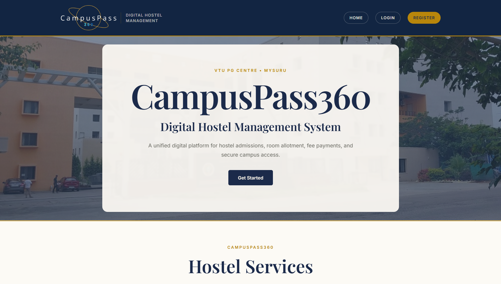
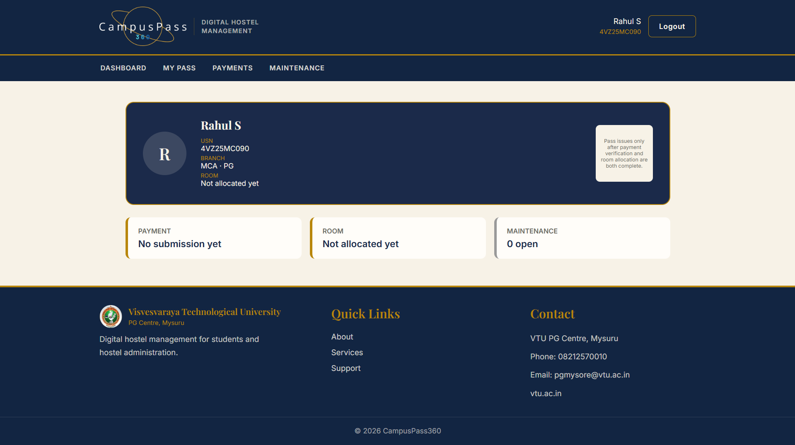
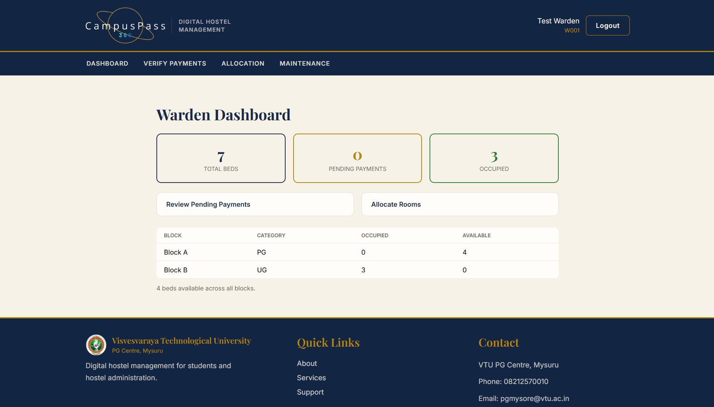
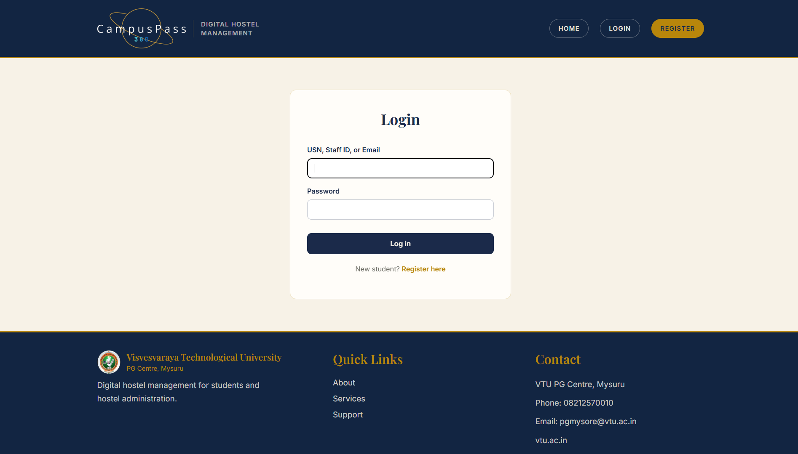
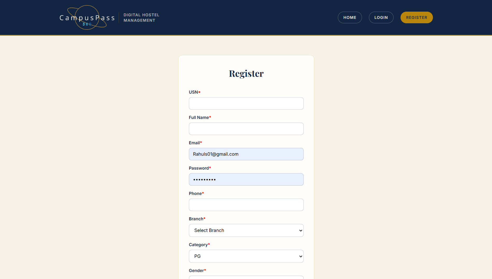
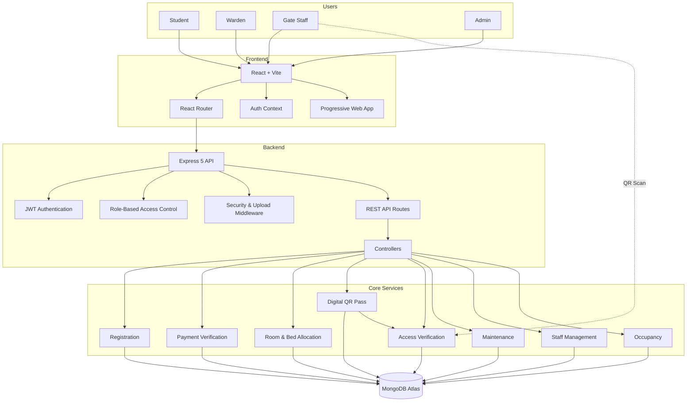
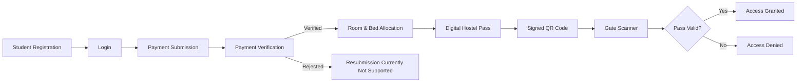
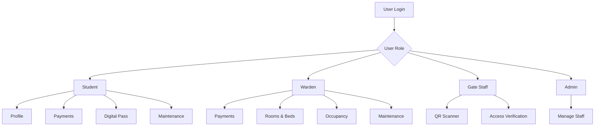

<div align="center">


# CampusPass360 
### Digital Hostel Management System


Registration · Payment Verification · Room Allocation · Digital Pass · QR Access

<p align="center">


</p>

<p align="center">


</div>


## Overview

CampusPass360 is a full-stack digital hostel management system designed for VTU PG Centre, Mysuru.

The system brings student registration, hostel payment submission, payment verification, room and bed allocation, digital hostel passes, and gate access verification into a single application.

Students can register, submit payment details, track their verification status, view their hostel allocation, and use a digital QR pass for hostel access. Wardens can manage payments, occupancy, rooms, beds, and maintenance requests, while gate staff can scan digital passes and verify access in real time.


## Why CampusPass360?

Hostel management involves several connected processes such as registration, payment verification, room allocation, and access control.

CampusPass360 connects these workflows through a single role-based system.

```text
Student Registration
        ↓
Payment Submission
        ↓
Payment Verification
        ↓
Room & Bed Allocation
        ↓
Digital Hostel Pass
        ↓
QR-Based Gate Verification
```


## Screenshots

### 1. Landing Page

<p align="center">
  
</p>

### 2. Student Page

<p align="center">
  
</p>

### 3. Warden Page

<p align="center">
  
</p>

### 4. Login

<p align="center">
  
</p>

### 5. Registration

<p align="center">
  
</p>


## Features

### Student

- Registration and login
- Profile management
- Hostel payment submission
- VTU rent reference submission
- Payment receipt PDF upload
- Mess DD payment details
- Payment verification status
- Digital hostel pass
- Signed and rotating QR code
- Room and bed information
- Maintenance ticket submission and tracking

### Warden

- Hostel occupancy dashboard
- Total, occupied, and available beds
- Block-wise hostel information
- Pending payment overview
- Rent payment verification
- Mess-DD payment verification
- Room and bed allocation
- UG/PG category-based allocation
- Payment-status-based allocation
- Maintenance ticket management

### Gate Staff

- Camera-based QR scanner
- QR-based hostel access verification

### Admin

- Initial administrator bootstrap
- Staff account provisioning
- Warden account management
- Gate-staff account management
- Staff management through the application

### Platform

- Progressive Web App
- Installable on supported devices
- Offline-capable application shell
- Mobile home-screen installation
- Responsive interface
- Role-based access control
- Server-side authorization
- JWT-based authentication
- Protected application routes


## Technology Stack

<table>
<tr>

<td align="center" width="170">
<br>
<b>JavaScript</b>
</td>

<td align="center" width="170">
<br>
<b>React</b>
</td>

<td align="center" width="170">
<br>
<b>Vite</b>
</td>

<td align="center" width="170">
<br>
<b>Node.js</b>
</td>

</tr>

<tr>

<td align="center">
<br>
<b>Express 5</b>
</td>

<td align="center">
<br>
<b>MongoDB Atlas</b>
</td>

<td align="center">
<br>
<b>Git</b>
</td>

<td align="center">
<br>
<b>GitHub</b>
</td>

</tr>
</table>

### Core Technologies

| Layer | Technology |
|----------|------------|
| Frontend | React, Vite, React Router |
| API Communication | Axios |
| QR Generation | qrcode.react |
| QR Scanning | html5-qrcode |
| PWA | vite-plugin-pwa |
| Backend | Node.js, Express 5 |
| Database | MongoDB Atlas |
| ODM | Mongoose |
| Authentication | JWT |
| Password Security | bcrypt |
| File Uploads | Multer |
| Frontend Hosting | Vercel |
| Backend Hosting | Render |


## System Architecture




## Hostel & Access Flow




## Role-Based Access




## Application Modules

| Module | Description |
|----------|-------------|
| Student Registration | Student account creation and profile management |
| Payment Management | Rent and mess-DD payment submission and verification |
| Hostel Allocation | Room and bed allocation based on payment and UG/PG eligibility |
| Digital Pass | Digital hostel pass with signed QR code |
| Gate Access | QR validation and real-time access decisions |
| Maintenance | Maintenance ticket submission and tracking |
| Staff Management | Warden and gate-staff account management |
| Occupancy Management | Block, room, and bed occupancy information |


## Security

CampusPass360 applies authentication and authorization at the application and API levels.

| Feature | Description |
|----------|-------------|
| JWT Authentication | Protects authenticated API requests |
| Role-Based Access Control | Restricts resources according to user role |
| Password Hashing | Passwords are hashed using bcrypt |
| Login Rate Limiting | Limits repeated login attempts |
| Signed QR Passes | QR passes use server-side signature validation |
| Protected Routes | Authentication and authorization are enforced on the server |
| File Validation | Uploaded payment receipts are validated |
| Upload Limits | Restricts uploaded file size |
| Environment Variables | Sensitive configuration is kept outside source code |

> **Security:** Never commit `.env` files, database credentials, JWT secrets, QR signing secrets, passwords, API keys, or private deployment credentials to the repository.


## Project Structure

```text
CampusPass360/
│
├── client/                              # React + Vite frontend
│   ├── public/                          # Static assets and PWA resources
│   │   ├── icon-192.png
│   │   ├── icon-512.png
│   │   └── ...
│   │
│   └── src/
│       ├── api/                         # Axios instance and API configuration
│       ├── components/                  # Reusable UI components
│       ├── context/                     # Authentication state
│       └── pages/                       # Application pages and routes
│
├── server/                              # Express 5 backend
│   ├── config/                          # Database configuration
│   ├── controllers/                     # Request and business logic
│   ├── middleware/                      # Authentication, roles, rate limiting, uploads
│   ├── models/                          # Mongoose models
│   ├── routes/                          # REST API routes
│   ├── utils/                           # Validators and utilities
│   ├── scripts/                         # Setup and seed scripts
│   │   ├── seedStaff.js
│   │   ├── seedRooms.js
│   │   └── getTokens.js
│   └── server.js                        # Backend entry point
│
├── docs/
│   └── screenshots/                     # README screenshots
│       ├── landing-page.png
│       ├── student-page.png
│       ├── warden-page.png
│       ├── login.png
│       └── registration.png
│
└── README.md
```


## Getting Started

### Prerequisites

- Node.js 20+
- npm
- Git
- MongoDB Atlas or local MongoDB

### Clone Repository

```bash
git clone https://github.com/shyampillai07/CampusPass360.git
cd CampusPass360
```

### Install Backend

```bash
cd server
npm install
```

### Install Frontend

```bash
cd ../client
npm install
```


## Environment Variables

Create `server/.env`:

```env
NODE_ENV=development
PORT=5000

MONGODB_URI=mongodb+srv://<username>:<password>@<cluster>/<database>

JWT_ACCESS_SECRET=<long-random-secret>
JWT_ACCESS_EXPIRES_IN=8h

CLIENT_ORIGIN=http://localhost:5173

BCRYPT_SALT_ROUNDS=12

LOGIN_RATE_LIMIT_WINDOW_MIN=15
LOGIN_RATE_LIMIT_MAX_ATTEMPTS=10

UPLOAD_MAX_MB=5

QR_SIGNING_SECRET=<different-long-random-secret>
```

Create `client/.env`:

```env
VITE_API_BASE_URL=http://localhost:5000/api
```

Generate a random secret:

```bash
node -e "console.log(require('crypto').randomBytes(48).toString('hex'))"
```

Use separate secrets for `JWT_ACCESS_SECRET` and `QR_SIGNING_SECRET`.


## Run Locally

### Backend

```bash
cd server
node server.js
```

API:

```text
http://localhost:5000
```

### Frontend

Open another terminal:

```bash
cd client
npm run dev
```

Application:

```text
http://localhost:5173
```


## Staff Account Bootstrap

Only students can self-register through the application.

The first administrator can be provisioned through the CLI:

```bash
cd server

node scripts/seedStaff.js \
  --role ADMIN \
  --staffId <staff-id> \
  --name "<admin-name>" \
  --email <admin-email> \
  --phone <admin-phone> \
  --password "<temporary-password>"
```

After the initial administrator is created, warden and gate-staff accounts can be managed through **Manage Staff** in the application.

Do not commit real staff credentials to the repository.


## Hostel Inventory

Hostel room and bed inventory can optionally be populated using:

```bash
cd server
node scripts/seedRooms.js
```


## API

### Health Check

| Method | Endpoint | Purpose |
|--------|----------|---------|
| GET | `/api/health` | API health check |

Production:

```text
https://campuspass360.onrender.com/api/health
```

Other application routes are organized under the backend `routes/` and `controllers/` directories.


## Deployment

### Backend

```text
Platform: Render
Service: Node Web Service
Root Directory: server/
Start Command: node server.js
```

### Frontend

```text
Platform: Vercel
Root Directory: client/
Framework: Vite
```

### Database

```text
Database: MongoDB Atlas
ODM: Mongoose
```


## Known Limitations

- Render's free tier uses ephemeral storage, so uploaded payment receipt PDFs may not persist after a cold restart.
- Production file uploads should use dedicated object storage rather than local server storage.
- An automated test suite has not yet been implemented.
- Current application flows have been verified manually.
- Payment resubmission after rejection is not currently supported for the same academic year.
- Bed release and transfer functionality is not yet implemented.
- Comprehensive audit logging is not yet implemented.


## License

This project is licensed under the [GNU General Public License v2.0](LICENSE).


## Contact

<p align="left">

<a href="mailto:shyam.m.pillai71@gmail.com">

</a>

<a href="https://linkedin.com/in/shyampillai07">

</a>

</p>

For questions, feedback, or collaboration opportunities, feel free to reach out.
